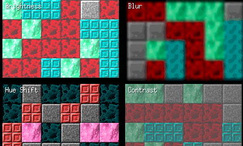

# Willow

[](https://pkg.go.dev/github.com/phanxgames/willow)
[](https://goreportcard.com/report/github.com/phanxgames/willow)
[](LICENSE)

A retained-mode 2D game framework for [Ebitengine](https://ebitengine.org)  -  scene graph, batching, cameras, interaction, and effects.
Inspired by [Starling](https://gamua.com/starling/), Flash display lists, and [PixiJS](https://pixijs.com/)  -  adapted for Go's strengths.

**Status:** Functional and actively developed. Core systems are working and used across all included examples. API may change before `v1.0.0`.

<p align="center">
  
  
  
  
</p>

> **New here?** Check out the [examples](examples/)  -  runnable demos with no external assets required.

---

## What is Willow?

Willow is a 2D game framework built on Ebitengine. It utlizies the retained-mode design pattern, which means you create a tree of nodes representing your game objects, and Willow handles passing the draw commands down to the Ebitengine.
A main focus of Willow is performance - it is designed to minimize heap allocations and maximize batching, with features like subtree command caching for static content, and a zero-allocation-per-frame contract on the hot path. While managing the display tree does have a slight runtime cost, in some instances Willow can be faster than raw Ebitengine draw calls due to better batching and caching strategies.

It sits between Ebitengine and your game:

```
Your Game             - gameplay, content, logic
Willow                - scene graph, rendering, interaction
Ebitengine            - GPU backend, window, audio, platform
```

---

## Why does Willow exist?

[Ebitengine](https://ebitengine.org) is an excellent, minimal 2D engine for Go - but every project beyond a prototype ends up building the same infrastructure from scratch: transform hierarchies, draw-call batching, hit testing, camera viewports, text layout, sprite atlases.

Willow exists so you don't have to rebuild that foundation every time.

It was created with a specific belief: **Go deserves a clean, structured way to build 2D games.** A framework that handles the rendering infrastructure so you can focus on gameplay.

Inspired by [Starling](https://gamua.com/starling/), Flash display lists, and [PixiJS](https://pixijs.com/)  -  scene graph architectures that powered millions of 2D games  -  adapted for Go's strengths: simplicity and performance.

---

## What Willow Is Not

- Not a full game engine  -  no built-in physics, networking, or asset pipelines
- Not a UI layout framework (a companion `willowui` library is planned)
- Not a replacement for Ebitengine  -  it builds on top of it

Willow focuses on structured rendering and scene composition. You bring the gameplay and domain logic.

---

## Goals

1. **Structure without handcuffs.** Willow provides hierarchy, transforms, and batching without imposing game architecture. Any genre, any pattern, any scale.
2. **Performance as a contract.** Zero heap allocations per frame on the hot path. 10,000 sprites at 120+ FPS on desktop, 60+ FPS on mobile and web. Verified with compiler escape analysis and benchmark suites.
3. **Wrap Ebitengine, never fight it.** Willow uses Ebitengine's lifecycle hooks, image types, and threading model directly.
4. **Minimal public API.** Every exported symbol earns its place. Fewer concepts, less to learn, less to break.
5. **Cross Platform.** Windows, macOS, Linux, iOS, Android, WebAssembly  -  wherever Ebitengine runs.

---

## Use Cases

Willow is well suited for:

- 2D games requiring structured layering and scene composition
- Games with worlds with large tile maps, cameras, and movement
- Game tooling and level editors built on a display tree
- Prototyping game rendering architectures on top of Ebitengine

---

## Quick start

```bash
go get github.com/phanxgames/willow@latest
```

For quick setup, call `willow.Run(scene, config)` and Willow handles the window and game loop. For full control, implement `ebiten.Game` yourself and call `scene.Update()` and `scene.Draw(screen)` directly  -  both paths are first-class.

```go
package main

import (
	"log"

	"github.com/phanxgames/willow"
)

func main() {
	scene := willow.NewScene()

	sprite := willow.NewSprite("hero", willow.TextureRegion{})
	sprite.ScaleX = 40
	sprite.ScaleY = 40
	sprite.Color = willow.Color{R: 0.3, G: 0.7, B: 1, A: 1}
	sprite.X = 300
	sprite.Y = 220
	scene.Root().AddChild(sprite)

	if err := willow.Run(scene, willow.RunConfig{
		Title:  "My Game",
		Width:  640,
		Height: 480,
	}); err != nil {
		log.Fatal(err)
	}
}
```

---

## Examples

Runnable examples are included in the [examples/](examples/) directory:

```bash
go run ./examples/basic        # Bouncing colored sprite
go run ./examples/shapes       # Rotating polygon hierarchy with parent/child transforms
go run ./examples/interaction  # Draggable, clickable rectangles with color toggle
go run ./examples/text         # Bitmap font text with colors, alignment, word wrap
go run ./examples/texttf       # TTF text with colors, per-line alignment, word wrap, and outline
go run ./examples/tweens       # Position, scale, rotation, alpha, and color tweens
go run ./examples/particles    # Fountain, campfire, and sparkler particle effects
go run ./examples/shaders      # 3x3 grid showcasing all built-in shader filters
go run ./examples/outline      # Outline and inline filters on a sprite
go run ./examples/masks        # Star polygon, cursor-following, and erase masking
go run ./examples/lighting     # Dark dungeon with colored torches and mouse-following lantern
go run ./examples/atlas        # TexturePacker atlas loading with named regions and magenta placeholders
go run ./examples/tilemap      # Tile map rendering with camera panning
go run ./examples/rope         # Draggable endpoints connected by a textured rope
go run ./examples/watermesh    # Water surface with per-vertex wave animation
```

---

## Documentation

- **[Willow Docs](https://phanxgames.github.io/willow/docs/)** - Guides, tutorials, and reference
- **[API Reference](https://pkg.go.dev/github.com/phanxgames/willow)** - Full API documentation on pkg.go.dev

---

## Features

- **Scene graph** - Parent/child transform inheritance (position, rotation, scale, skew, pivot) with alpha propagation and Pixi-style `ZIndex` sibling reordering.
- **Sprite batching** - [TexturePacker](https://www.codeandweb.com/texturepacker) JSON atlas loading with multi-page, trimmed, and rotated region support. Consecutive draws are grouped automatically into single `DrawImage` calls.
- **Camera system** - Multiple independent viewports with smooth follow, scroll-to animation (45+ easings), bounds clamping, frustum culling, and world/screen coordinate conversion.
- **Input and interaction** - Hierarchical hit testing with pluggable shapes (rect, circle, polygon). Pointer capture, drag dead zones, multi-touch, and two-finger pinch with rotation. Callbacks per-node or scene-wide.
- **Text rendering** - Bitmap fonts (BMFont `.fnt`) for pixel-perfect rendering, TTF fallback via Ebitengine `text/v2`. Alignment, word wrapping, line height overrides, and outlines.
- **Particle system** - CPU-simulated with preallocated pools. Configurable emit rate, lifetime, speed, gravity, and scale/alpha/color interpolation. Optional world-space emission.
- **Mesh support** - `DrawTriangles` with preallocated vertex and index buffers. High-level helpers for rope meshes, filled polygons, and deformable grids.
- **Subtree command caching** - `SetCacheAsTree` caches all render commands for a container's subtree and replays them with delta transform remapping. Camera panning, parent movement, and alpha changes never invalidate the cache. Animated tiles (same-page UV swaps) are handled automatically via a two-tier source pointer - no invalidation, no API overhead. Manual and auto-invalidation modes. Includes sort-skip optimization when the entire scene is cache hits.
- **Filters and effects** - Composable filter chains via Kage shaders. Built-in: color matrix, blur, outline, pixel-perfect outline, pixel-perfect inline, palette swap. Render-target masking and `CacheAsTexture`.
- **Lighting** - Dedicated lighting layer using erase-blend render targets with automatic compositing.
- **Animation** - Tweening via [gween](https://github.com/tanema/gween) with 45+ easing functions. Convenience wrappers for position, scale, rotation, alpha, and color. Auto-stops on node disposal.
- **ECS integration** - Optional `EntityStore` interface to bridge interaction events into your ECS. Ships with a [Donburi](https://github.com/yohamta/donburi) adapter.
- **Debug mode** - Performance timers, draw call and batch counting, tree depth warnings, and disposed-node assertions via `scene.SetDebugMode(true)`.

---

## Performance

Willow is designed around a zero-allocation-per-frame contract on the hot path:

- Preallocated command buffer reused each frame
- Dirty flag propagation - static subtrees skip transform recomputation entirely
- Custom merge sort with preallocated scratch buffer (no `sort.SliceStable` allocations)
- Typed callback slices - no `interface{}` boxing in event dispatch
- Render-texture pooling by power-of-two size buckets
- Value-type `DrawImageOptions` declared once, reused per iteration

**Subtree command caching** (`SetCacheAsTree`) avoids re-traversing static subtrees entirely. Commands are stored at cache time and replayed with a single matrix multiply per command. Camera movement, parent transforms, and alpha changes are handled via delta remapping. Animated tiles (UV swaps within the same atlas page) are handled automatically via a two-tier source pointer indirection - no invalidation, no API overhead. This is designed to allow batch group of tilemaps with animated tiles (e.g. water) to be performance-optimized by avoiding full subtree invalidation on every frame.

| Scenario (10K sprites) | Time | vs uncached |
|---|---|---|
| Manual cache, camera scrolling | ~39 &mu;s | ~125x faster |
| Manual cache, 100 animated tile UV swaps | ~1.97 ms | ~2.5x faster |
| Auto cache, 1% of children moving | ~4.0 ms | ~1.2x faster |
| No cache (baseline) | ~4.9 ms |  -  |

The cache is per-container, and will be invalidated if a child within the container moves. It is recommended to separate static content (tilemaps, UI panels) from dynamic content (players, projectiles) into different containers for best results.

Benchmark suite included: `go test -bench . -benchmem`

---

## Roadmap

- **Dynamic atlas packing**  -  Runtime `Atlas.Add(name, img)` for lazy asset loading. Shelf/guillotine packing into existing atlas pages to preserve batching.
- UI widget layer (buttons, text input, layout, focus traversal) as a separate companion library (willowui)
- Example projects and starter templates
- Comprehensive API documentation and guides
- Tutorials and integration walkthroughs
- Performance profiling across mobile and WebAssembly targets
- Community feedback and API stabilization

---

## Built with

- **Go** 1.24+
- **Ebitengine** v2.9+
- Currently tested on: macOS and WebAssembly

---

## Contributing

Contributions are welcome. Please a pull request and ensure tests pass. For major changes, open an issue first to discuss the design and implementation.

---

## License

MIT - see [LICENSE](LICENSE) for details.
