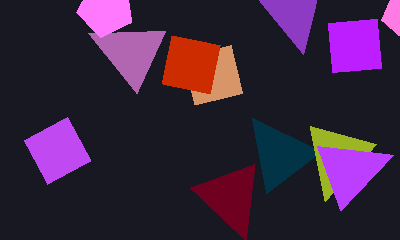
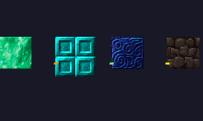

# Willow

[](https://pkg.go.dev/github.com/phanxgames/willow)
[](https://goreportcard.com/report/github.com/phanxgames/willow)
[](LICENSE)

A retained-mode 2D scene graph, interaction layer, and render compiler for [Ebitengine](https://ebitengine.org).

<p align="center">
  
  
  
  
</p>

> **New here?** Check out the [examples](examples/) — runnable demos with no external assets required.

---

## What is Willow?

Willow is a structured foundation for 2D applications built on Ebitengine. It provides the scene graph, input handling, sprite batching, and rendering pipeline that every non-trivial 2D project needs - packaged as a single, focused library.

It sits between Ebitengine and your game:

```
Your Game             - gameplay, content, logic
willow                - scene graph, rendering, interaction
Ebitengine            - GPU backend, window, audio, platform
```

Willow is not a game engine. It is not a framework. It does not own your game loop, impose an architecture, or make decisions for you. You call `scene.Update()` and `scene.Draw(screen)` from your own `ebiten.Game` implementation, and Willow handles the rest.

---

## Why does Willow exist?

[Ebitengine](https://ebitengine.org) is an excellent, minimal 2D engine for Go - but every project beyond a prototype ends up building the same infrastructure from scratch: transform hierarchies, draw-call batching, hit testing, camera viewports, text layout, sprite atlases.

Willow exists so you don't have to rebuild that foundation every time.

It was created with a specific belief: **Go deserves a clean, structured way to build 2D applications.** Not a heavy framework that dictates how you work, but a transparent layer that handles the tedious parts and gets out of the way.

Inspired by [Starling](https://gamua.com/starling/), Flash display lists, and [PixiJS](https://pixijs.com/) - scene graph architectures that powered millions of 2D applications - adapted for Go's strengths: simplicity, performance, and zero magic.

---

## Goals

1. **Structure without handcuffs.** Willow provides hierarchy, transforms, and batching. It does not impose game architecture. Any genre, any pattern, any scale.
2. **Transparent, not magical.** No hidden state, no implicit systems, no reflection in hot paths. You can always see what Willow is doing and why.
3. **Performance as a contract.** Zero heap allocations per frame on the hot path. 10,000 sprites at 120+ FPS on desktop, 60+ FPS on mobile and web. Verified with compiler escape analysis and benchmark suites.
4. **Wrap Ebitengine, never fight it.** Willow uses Ebitengine's draw calls, image types, and threading model directly. No abstraction layer that hides what's happening underneath.
5. **No genre bias.** Willow is for any 2D project - games, tools, visualizations, simulations.
6. **Minimal public API.** Every exported symbol earns its place. Fewer concepts, less to learn, less to break.

---

## Quick start

```bash
go get github.com/phanxgames/willow@latest
```

```go
package main

import (
	"github.com/hajimehoshi/ebiten/v2"
	"github.com/phanxgames/willow"
)

type Game struct{ scene *willow.Scene }

func (g *Game) Update() error { g.scene.Update(); return nil }
func (g *Game) Draw(screen *ebiten.Image) { g.scene.Draw(screen) }
func (g *Game) Layout(w, h int) (int, int) { return w, h }

func main() {
	scene := willow.NewScene()

	sprite := willow.NewSprite("hero", myAtlas.Region("hero_idle"))
	sprite.X, sprite.Y = 400, 300
	scene.Root().AddChild(sprite)

	ebiten.RunGame(&Game{scene: scene})
}
```

---

## Examples

Runnable examples are included — no external assets needed:

```bash
go run ./examples/basic        # Bouncing colored sprite
go run ./examples/shapes       # Rotating polygon hierarchy with parent/child transforms
go run ./examples/interaction  # Draggable, clickable rectangles
go run ./examples/tilemap      # Tile map rendering with camera controls
```

---

## Features

- **Scene graph** - Parent/child transform inheritance (position, rotation, scale, skew, pivot) with alpha propagation and Pixi-style `ZIndex` sibling reordering.
- **Sprite batching** - [TexturePacker](https://www.codeandweb.com/texturepacker) JSON atlas loading with multi-page, trimmed, and rotated region support. Consecutive draws are grouped automatically into single `DrawImage` calls.
- **Camera system** - Multiple independent viewports with smooth follow, scroll-to animation (45+ easings), bounds clamping, frustum culling, and world/screen coordinate conversion.
- **Input and interaction** - Hierarchical hit testing with pluggable shapes (rect, circle, polygon). Pointer capture, drag dead zones, multi-touch, and two-finger pinch with rotation. Callbacks per-node or scene-wide.
- **Text rendering** - Bitmap fonts (BMFont `.fnt`) for pixel-perfect rendering, TTF fallback via Ebitengine `text/v2`. Alignment, word wrapping, line height overrides, and outlines.
- **Particle system** - CPU-simulated with preallocated pools. Configurable emit rate, lifetime, speed, gravity, and scale/alpha/color interpolation. Optional world-space emission.
- **Mesh support** - `DrawTriangles` with preallocated vertex and index buffers. High-level helpers for rope meshes, filled polygons, and deformable grids.
- **Filters and effects** - Composable filter chains via Kage shaders. Built-in: color matrix, blur, outline, pixel-perfect outline, pixel-perfect inline, palette swap. Render-target masking and `CacheAsTexture`.
- **Lighting** - Dedicated lighting layer using erase-blend render targets with automatic compositing.
- **Animation** - Tweening via [gween](https://github.com/tanema/gween) with 45+ easing functions. Convenience wrappers for position, scale, rotation, alpha, and color. Auto-stops on node disposal.
- **ECS integration** - Optional `EntityStore` interface to bridge interaction events into your ECS. Ships with a [Donburi](https://github.com/yohamta/donburi) adapter.
- **Debug mode** - Performance timers, draw call and batch counting, tree depth warnings, and disposed-node assertions via `scene.SetDebugMode(true)`.

---

## Architecture

```
Your Game (ebiten.Game)
    │
    ▼
┌────────────────────────────────┐
│  Scene                         │
│  ├─ Update(): input → events   │
│  └─ Draw():  traverse → sort   │
│              → batch → submit  │
└────────────────────────────────┘
    │
    ▼
┌────────────────────────────────┐
│  Node tree                     │
│  Container ─┬─ Sprite          │
│             ├─ Sprite          │
│             ├─ Text            │
│             ├─ ParticleEmitter │
│             └─ Container ──…   │
└────────────────────────────────┘
    │
    ▼
┌────────────────────────────────┐
│  Ebitengine                    │
│  DrawImage / DrawTriangles     │
└────────────────────────────────┘
```

**Rendering:** Depth-first traversal, dirty transform recomputation, camera culling, render command emission, stable sort by layer and order, batch grouping, Ebitengine submission.

**Interaction:** Pointer input processing, hierarchical hit testing in reverse painter order, scene-level callbacks, per-node callbacks, optional ECS event routing.

---

## Performance

Willow is designed around a zero-allocation-per-frame contract on the hot path:

- Preallocated command buffer reused each frame
- Dirty flag propagation - static subtrees skip transform recomputation entirely
- Custom merge sort with preallocated scratch buffer (no `sort.SliceStable` allocations)
- Typed callback slices - no `interface{}` boxing in event dispatch
- Render-texture pooling by power-of-two size buckets
- Value-type `DrawImageOptions` declared once, reused per iteration

Benchmark suite included: `go test -bench . -benchmem`

---

## Roadmap

- Example projects and starter templates
- Comprehensive API documentation and guides
- Tutorials and integration walkthroughs
- UI widget layer (buttons, text input, layout, focus traversal) as a separate companion library (willow-ui)
- Performance profiling across mobile and WebAssembly targets
- Community feedback and API stabilization

---

## Requirements

- **Go** 1.24+
- **Ebitengine** v2.9+
- All Ebitengine-supported platforms: Windows, macOS, Linux, iOS, Android, WebAssembly

---

## Contributing

Contributions are welcome. Please open an issue to discuss proposed changes before submitting a pull request.

---

## License

MIT - see [LICENSE](LICENSE) for details.
